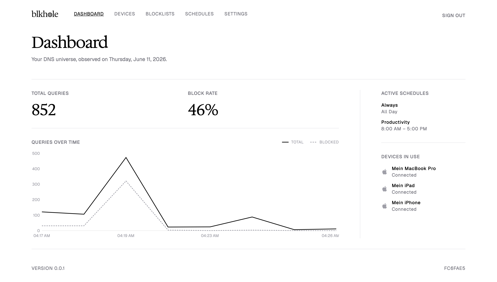
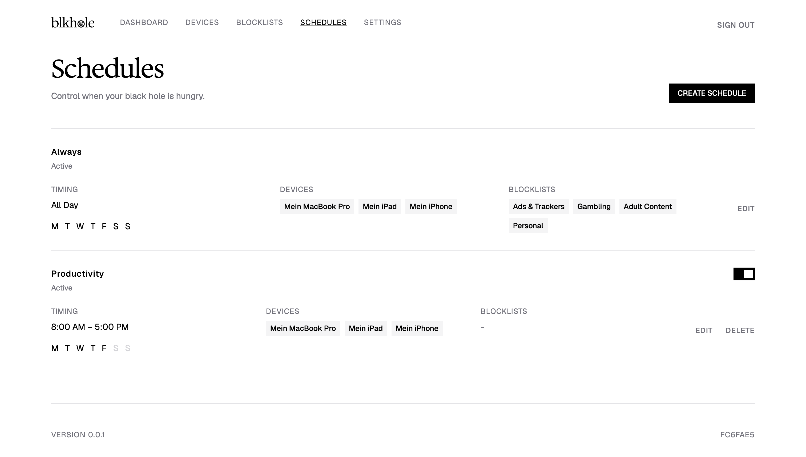

# blkhole

Self-hosted, encrypted DNS blocking with a ruleset per device and a clock.

blkhole serves DNS over HTTPS and TLS, so queries are encrypted on the wire
instead of readable by everyone between you and your resolver. Each device
gets its own endpoint and its own rules: which blocklists apply, and on
which days and hours they do.

One Go binary. SQLite for storage, Let's Encrypt for certificates, a web UI
for everything else.



## Features

- DNS-over-HTTPS and DNS-over-TLS (port 853), with per-device endpoints
- Blocklists: import any hosts/adblock-format URL or add domains by hand
- Five curated lists seeded on signup (ads and trackers, social media, gambling, fake news, adult content)
- Schedules: block by time of day and day of week, per device, with 5-minute precision
- Query log with CSV export, pruned after 90 days
- Live dashboard showing total and blocked queries over 24h, 7d, or 30d
- One-click `.mobileconfig` profile for iOS and macOS
- Automatic HTTPS via Let's Encrypt, including device subdomains

## How it works

Every device you register gets a random hash. Point the device at its
personal DoH endpoint:

```
https://{deviceHash}.yourdomain.com/dns-query
```

DoT works the same way, with `{deviceHash}.yourdomain.com` as the TLS
hostname on port 853. blkhole reads the hash from the subdomain, looks up
which schedules and blocklists apply to that device right now, and answers
NXDOMAIN for blocked domains. Everything else is forwarded to the upstream
resolver (Cloudflare by default, configurable).

Queries from hashes it doesn't know get refused, so the server can't be
used as an open resolver.



## Installation

### go install

Requires Go 1.25+ and a C compiler (gcc or clang) for SQLite.

```sh
CGO_ENABLED=1 go install github.com/blkhole-sh/blkhole@latest
```

### Docker

The default image is distroless, a few MB of attack surface in total:

```sh
docker build -t blkhole .
docker run -d \
  -v blkhole-data:/root/.config/blkhole \
  -p 80:80 -p 443:443 -p 853:853 \
  blkhole -d yourdomain.com -s $(openssl rand -hex 32)
```

There's also a variant that bundles the Unbound recursive resolver, so you
don't depend on any upstream DNS provider at all:

```sh
docker build -f Dockerfile.unbound -t blkhole:unbound .
docker run -d \
  -v blkhole-data:/data \
  -p 53:53/udp -p 53:53/tcp -p 8080:8080 \
  blkhole:unbound
```

Flow: `Client → blkhole:53 → Unbound:5353 → Root DNS servers`

### Fly.io

A ready-made `fly.toml` is included. Set the secret and deploy:

```sh
fly secrets set BLKHOLE_SECRET=$(openssl rand -hex 32)
fly deploy
```

## Running

```sh
# Production: HTTPS with automatic certificates, DoT on :853
blkhole -d yourdomain.com -s $(openssl rand -hex 32)

# Local: plain HTTP, no TLS, no DoT
blkhole -p 8080 -s $(openssl rand -hex 32)
```

| Flag | Env var | Description | Default |
|---|---|---|---|
| `-d <domain>` | `BLKHOLE_DOMAIN` | Production mode: HTTPS with autocert | none |
| `-p <port>` | `BLKHOLE_PORT` | Local mode: plain HTTP | none |
| `-u <host:port>` | `BLKHOLE_UPSTREAM_DNS` | Upstream DNS server | `1.1.1.1:53` |
| `-s <hex>` | `BLKHOLE_SECRET` | JWT secret (hex-encoded, 32 bytes) | none, required |

`-d` and `-p` are mutually exclusive. One is required.

Production mode needs ports 80 and 443 reachable and your domain's DNS
(including a wildcard for the device subdomains) pointing at the server, or
autocert can't issue certificates.

## First steps

1. Open the web UI and create an account. You start with the five default
   blocklists and an always-on "Always" schedule.
2. Under **Devices**, add a device. On iOS or macOS, download its
   mobileconfig profile and you're done; on other platforms, paste the
   device's DoH URL into the encrypted-DNS settings of the OS or browser.
3. Under **Blocklists**, import more lists or build your own.
4. Under **Schedules**, decide when blocking applies (time of day, days of
   week) and attach devices and lists.

## Development

```sh
just dev     # frontend dev server (bun) + backend with hot reload (air)
just build   # production build: web assets + stripped Go binary
go test ./...
```

The frontend lives in `web/` (SolidJS, UnoCSS, Biome) and needs Bun 1.3+.
The backend is plain Go with chi and SQLite; built web assets are embedded
into the binary, so the result is a single file.

## Contributing

Contributions are welcome. For anything bigger than a small fix, open an
issue first so we can talk it through.

## License

AGPL-3.0
